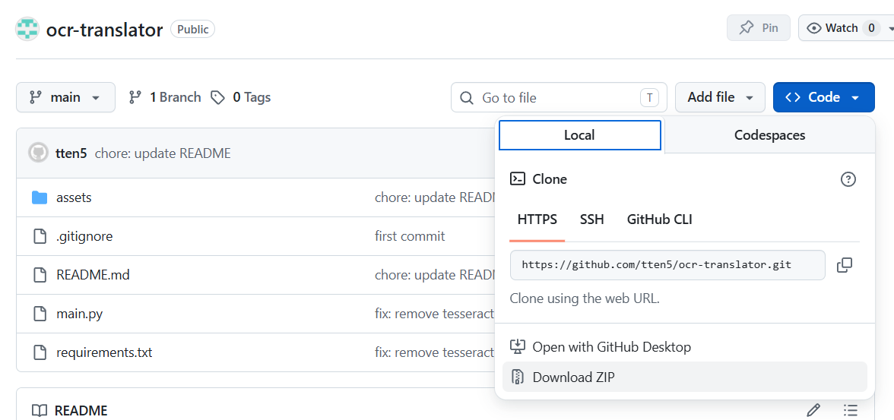
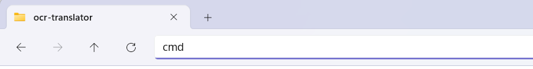

# OCR-Translator

## Overview
This app does 2 things
- OCR: Scan the selected area to extract the text. Currently, the code is set up to read vertical text, from right to left. so it will not work for other purposes.
- Translator: Get the text and feed it to Google Translate API 

## First installation

- Download Python 3.13 (Must be 3.13): https://www.python.org/downloads/release/python-31313/ 
    - Scroll down and find `Windows installer (64-bit)`, download it and install 
    - What is Python? It is the language and environment to run this app

- Download this app as zip and extract it into `ocr-translator` folder. Open `ocr-translator`.


- Click the address bar at the top (the part that shows the folder path like C:\Users\Name\Downloads/ocr-translator)
- You’ll see the path becomes editable (text is highlighted)
- Type `cmd` and enter



- Make sure it shows something like this `C:\Users\Name\Downloads\ocr-translator` (the actual path based on where you put your folder)

- Copy this whole command, paste to the terminal, then enter
```bash
python -m venv venv3 && call venv3\Scripts\activate.bat && python -m pip install -r requirements.txt
```

- Then copy paste this command and enter 
```bash
python main.py
```

- As long as you are still inside the same terminal, you just need to re-run `python main.py` if you accidentally close the app.

## After the first installation
- After the first installation, every time you open a new terminal, please copy paste this command and enter  
```bash
venv3\Scripts\activate.bat
```
first. 
- Then run 
```bash
python main.py
```
- As long as you are still inside the same terminal, you just need to re-run `python main.py` if you accidentally close the app.

## You want to change ocr source language and translator source language?
- Use notepad to open [main.py](./main.py) file
- Find the line "# CONFIG HERE" at the bottom of the file
- Then change `ocr_src_lang` and ` translator_src_lang` (remember to put the text inside single-quotation mark `''`)

## How to use 
We have 3 buttons
- Select Area: Click the button first, then select the area on screen that you want to capture text
- Clear: Clear all text inside the text box (Just to make it nicer, no special function) 
- Translate Selection: Sometimes you want to copy and paste text instead of "select area" and rely on OCR. Paste the text to the text box, then use mouse to select it, then click this button for translation.

## Tips
- You should select the entire speech bubble per each drag. The idea is that if those lines (or columns) are meant to be read together, you should select them together.
- If the translation sounds weird, it’s likely that the selected area is off, or that you included too many or too few lines. Please try selecting again.
- You can edit the text inside the textbox. Thus, you can copy, change, add, remove any text. Please use that ability together with `Translate Selection` button for more flexibility. Sometimes, a `!` gives different translation.

